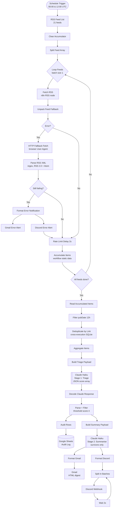

# Threat Intel Digest

An automated, AI-powered threat intelligence pipeline that runs twice daily on a self-hosted n8n instance. It ingests 21 security RSS feeds, triages every item with Claude (Anthropic), and delivers a scored, summarised digest to Discord and Gmail — filtered to what is actually relevant for your environment.

---

## How It Works

Two Claude API calls per run — triage first, summarise only what passes.



---

## Features

- **Dual-stage Claude pipeline** — triage scores every item first (cost-efficient); summarisation runs only on items that pass the threshold, keeping token usage low
- **21 RSS feeds** across threat intel, DFIR, vendor research, ICS/OT, and national CERTs
- **Relevance scoring (0-10)** — configurable for your stack and region
- **Auto-elevation and auto-downgrade rules** in the triage prompt to catch edge cases (CISA KEV additions, nation-state campaigns against CNI, infostealer IOC drops, PhaaS infrastructure)
- **Two-layer fallback fetch** — n8n RSS node first, HTTP fallback with browser `User-Agent` second (handles bot-blocked feeds like BankInfoSecurity and Fortiguard)
- **Cross-execution deduplication** via n8n SQLite — items seen in previous runs are suppressed
- **12-hour pubDate filter** per run, with pass-through for undated items to avoid silent feed drops
- **Audit log** (Google Sheets) recording every item: `PASSED`, `REJECTED`, or `UNSCORED` — used for triage threshold calibration
- **Error notification branch** — failed feeds alert to both Discord and Gmail with feed name, URL, HTTP status, and error detail
- **Discord chunking** — output split at item boundaries, max 1,950 chars per message, 2s delay between webhook calls to prevent 429s and preserve order
- **All credentials and IDs sanitised** in the published workflow export

---

## Tech Stack

| Component | Technology |
|---|---|
| Orchestration | [n8n](https://n8n.io/) (self-hosted, Docker) |
| Hosting | AWS Lightsail — Ubuntu 24.04 LTS |
| AI / Triage | Anthropic Claude API (`claude-haiku-4-5-20251001`) |
| Notifications | Discord Webhook, Gmail (OAuth2) |
| Audit Log | Google Sheets (OAuth2) |
| Language | JavaScript (n8n Code nodes) |
| Deduplication | n8n SQLite (built-in, cross-execution) |

---

## Pipeline Stages

### Stage 1 — Triage

- Input: `title` + `contentSnippet` only (compact, cost-efficient)
- Model: `claude-haiku-4-5-20251001`, max_tokens: 2000
- Output: JSON array — `{ id, score, category, reason }`
- Threshold: score >= 4 passes; score < 4 is rejected

**Scoring rubric (0-10):**

| Score | Criteria |
|---|---|
| 10 | Direct mention of your organisation or core platforms. Actively exploited zero-day in the exact analyst stack. |
| 8-9 | Nation-state campaigns against CNI in your target region. Ransomware hitting CNI. ICS/SCADA/PLC vulnerabilities. Supply chain compromise of security or IT tooling. PAM/privileged access compromise. |
| 6-7 | Windows/AD/Azure tradecraft (Kerberoasting, DCSync, ADCS, OAuth abuse, AiTM, BYOVD). New ransomware TTPs. AI/LLM attacks (prompt injection, MCP exploits). Container/K8s escapes. Infostealer campaigns with IOCs. PhaaS infrastructure. SIEM/XDR evasion. |
| 4-5 | DFIR and detection engineering (Sigma, KQL, YARA, Sysmon, Velociraptor). MITRE ATT&CK research. Linux/macOS enterprise attacks. CVEs with RCE/SSRF/auth bypass primitives, no confirmed exploitation. |
| 2-3 | Generic vulnerability disclosures. Security industry news. Tangential research. |
| 0-1 | Vendor marketing, conference announcements, consumer advice, off-topic content. |

### Stage 2 — Summarise

- Input: threshold-passing items only
- Model: `claude-haiku-4-5-20251001`, max_tokens: 10000
- Per-item output: Title, Source, Published, Category, Relevance Score, Summary (2 sentences), Suggested Action, Read More link
- Sorted by relevance score descending
- `triageScore` used verbatim — model is instructed not to adjust it

---

## RSS Feeds (21)

| Source | Type |
|---|---|
| The Hacker News | General threat news |
| Bleeping Computer | Vulnerability and malware news |
| Krebs on Security | Investigative threat intel |
| Dark Reading | Industry security news |
| BankInfoSecurity | Financial sector / CNI |
| Cisco Talos | Vendor threat research |
| Palo Alto Unit 42 | Vendor threat research |
| Malwarebytes Blog | Malware analysis |
| Microsoft Security Blog | Microsoft stack advisories |
| Rapid7 Blog | Vulnerability research |
| SANS ISC | Daily threat indicators |
| Fortiguard IR | Vendor IR advisories |
| Recorded Future | Threat intelligence |
| Malware Traffic Analysis | PCAP / traffic analysis |
| CISA ICS Advisories | OT/ICS advisories |
| The DFIR Report | DFIR case studies |
| JPCERT/CC | National CERT |
| Elastic Security Labs | Detection research |
| CrowdStrike Blog | Vendor threat research |
| SentinelOne Labs | Malware and threat research |
| Red Canary | Detection engineering |

---

## Repository Structure

```
Threat_Intel_Digest/
├── README.md                          # This file
├── SETUP.md                           # Deployment and configuration guide
├── FEEDS.md                           # Feed list with notes
├── samples/                           # Sample output screenshots
│   ├── README.md                      # Rendered sample gallery
│   ├── discord_digest.png
│   ├── discord_crawl_failure.png
│   ├── email_digest.png
│   ├── email_crawl_failure.png
│   ├── gsheet_triage_audit.png
│   └── gsheet_feed_noise_analysis_chart.png
└── workflow/
    └── Threat_Intel_Digest_Published_v1.0.json   # n8n workflow export (sanitised)
```

---

## Prerequisites

- n8n (self-hosted) — tested on v2.14.2
- Anthropic API key ([console.anthropic.com](https://console.anthropic.com)) — **set a monthly spend limit in Console > Settings > Limits before activating** to cap exposure if the key is ever compromised
- Discord server with a webhook URL
- Gmail account with OAuth2 configured in Google Cloud Console
- Google Sheets (for the audit log)

See [SETUP.md](./SETUP.md) for step-by-step configuration.

---

## Estimated Running Cost

- Claude API (Haiku): under $5/month at twice-daily cadence with 21 feeds
- AWS Lightsail: $7/month (1GB RAM, 2 vCPUs)

---

## Roadmap

- [ ] Telegram feed ingestion via RSS bridge or Bot API
- [ ] Onion-site crawling for dark web leak sites and underground forums (Tor + scraper)
- [ ] Weekly rollup digest
- [ ] MITRE ATT&CK technique tagging in the summarise prompt
- [ ] IOC extraction (IPs, domains, hashes, CVE IDs) to structured output
- [ ] Detection rule suggestions (Sigma / KQL / YARA) generated by the summarise prompt

---

## License

MIT
