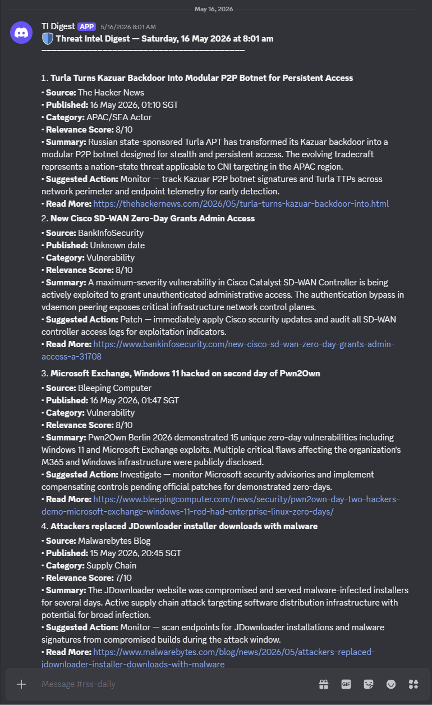
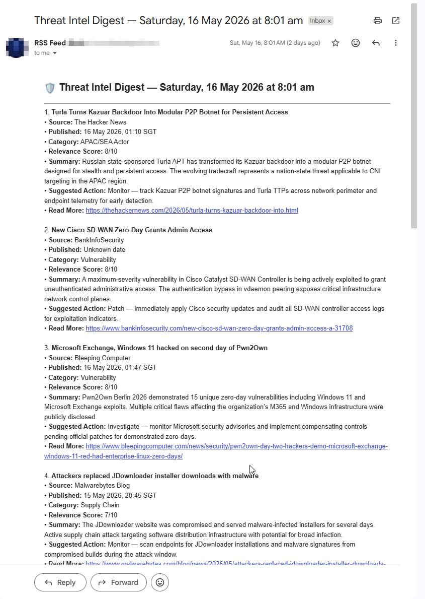
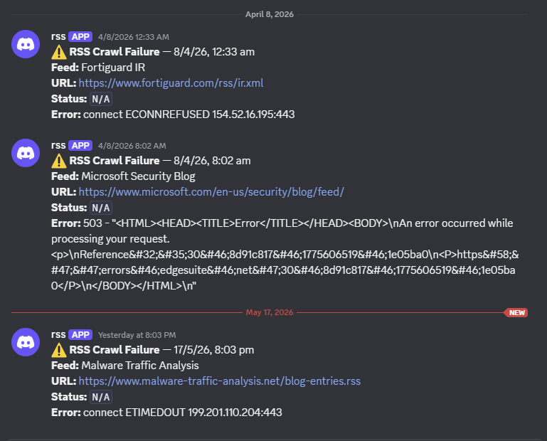
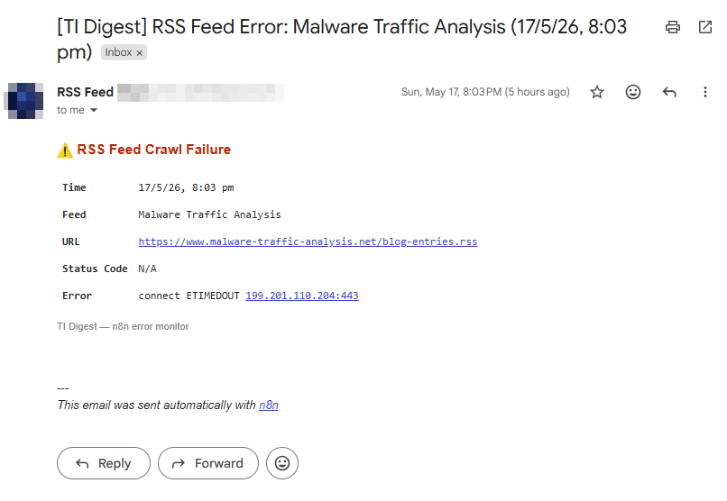
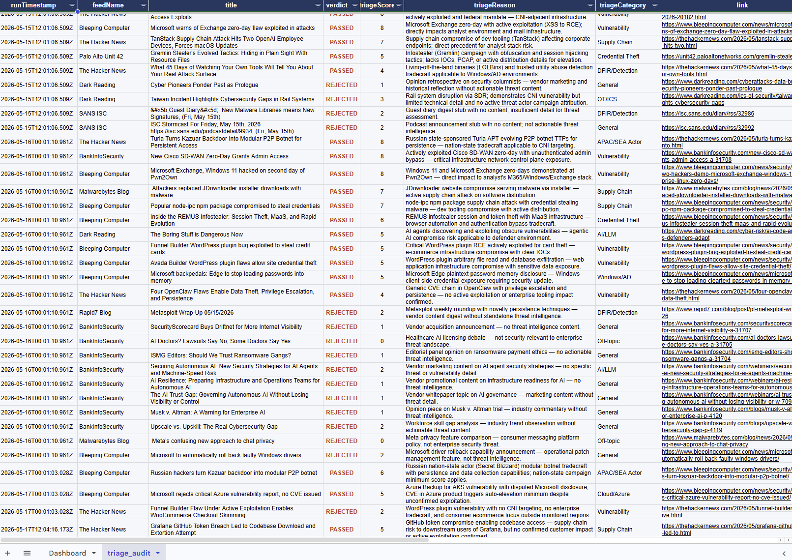
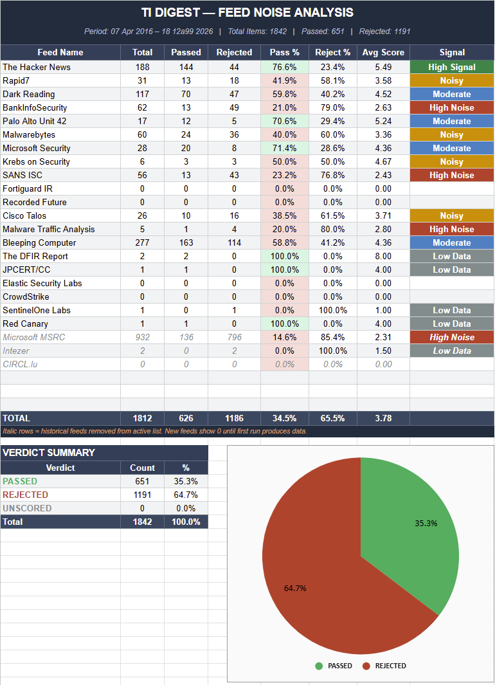

# Sample Output

Real output from a live pipeline run. All screenshots are from actual digest executions — no mock data.

---

## Digest — Discord

Twice-daily digest delivered to a Discord channel. Items sorted by relevance score descending, each with source, category, AI-generated summary, and suggested action.

---

## Digest — Email (Gmail)

Same digest delivered as an HTML email via Gmail OAuth2.

---

## Error Notifications

When a feed fails to fetch (connection timeout, bot block, HTTP error), the error notification branch fires immediately — separate from the digest run. Alerts go to both Discord and Gmail with feed name, URL, status code, and error detail.

**Discord:**

**Gmail:**

---

## Audit Log — Triage Audit Raw Data

Every item processed by the pipeline is logged to Google Sheets with verdict (`PASSED` / `REJECTED`), triage score, category, reason, feed name, and link. This raw audit data is used for threshold calibration and feed quality analysis.

---

## Audit Log — Feed Noise Analysis

Summary chart built on top of the raw audit data. Shows pass rate, reject rate, and average score per feed — used to identify high-noise feeds and calibrate the triage threshold over time.

